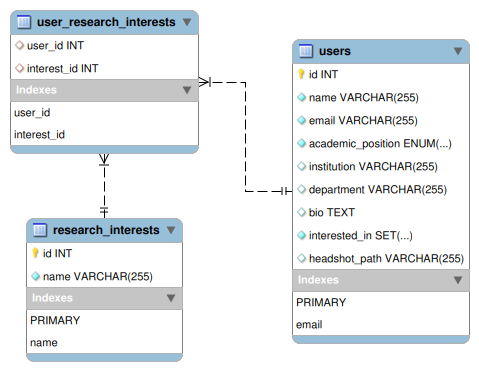

# 🎓 Mentorship & Research Collaboration Matching System

A clean, web-based platform that allows students, faculty, and researchers to create academic profiles, search for others by research interest or mentorship intent, and connect for collaboration.

Built using **Flask**, **MySQL**, and **HTML/CSS**, this project was completed as part of a database design course and demonstrates a fully functional CRUD+Search system backed by a normalized relational schema.

---

## Features

- Create academic profiles with position, institution, bio, and headshot
- Select up to 5 research interests (with keyword reuse and autocomplete)
- Indicate intent: Collaboration, Providing Mentorship, Receiving Mentorship
- View all profiles in a clean, tabular layout
- Full-text and filter-based search:
  - Name, Institution, Department
  - Position & Interested-In filters (checkboxes)
  - Keyword match for interests
- Email-based profile update & deletion
- Built-in matching logic to connect users with shared interests and compatible roles

---

## 🖼️ Homepage Preview

Here's what the profile table looks like in action:


---


## ER Diagram

Below is the core database design, normalized to 3NF with clean many-to-many relationships:



---

## Getting Started

### Requirements

- Python 3.10+
- MySQL Server
- Flask (`flask`, `flask-mysqldb`)
- Linux/macOS or WSL recommended for environment setup

---

### Installation Steps

#### 1. Clone the Repository
```bash
git clone <repo-url>
cd mentorship_database
```

#### 2. Create and Activate a Virtual Environment
```bash
python3 -m venv my_venv
source my_venv/bin/activate
```

#### 3. Install Dependencies
```bash
pip install -r requirements.txt
```

#### 4. Set Up the MySQL Database
```bash
mysql -u root -p
```
Inside the MySQL shell:
```sql
CREATE DATABASE mentorship_db;
EXIT;
```

#### 5. Import the Schema and Demo Data
```bash
mysql -u root -p mentorship_db < sql/mentorship_db_backup.sql
```

#### 6. Launch the App
```bash
python app.py
```

Now visit [http://127.0.0.1:5000](http://127.0.0.1:5000) in your browser.

---

## 📂 Project Structure

```
📁 mentorship_database/
├── app.py
├── config.py
├── templates/
│   ├── home.html
│   ├── create_profile.html
│   ├── edit_profile.html
│   └── ...
├── static/
│   ├── ER_diagram.png
│   └── uploads/
├── sql/
│   ├── mentorship_db_backup.sql
├── requirements.txt
└── README.md
```

---

## ✅ Final Notes

- All dummy profiles and field/interest options are already included in the backup SQL
- Interest matching, flexible filtering, and email-based updates are fully implemented
- This project highlights a working end-to-end database application with web integration

